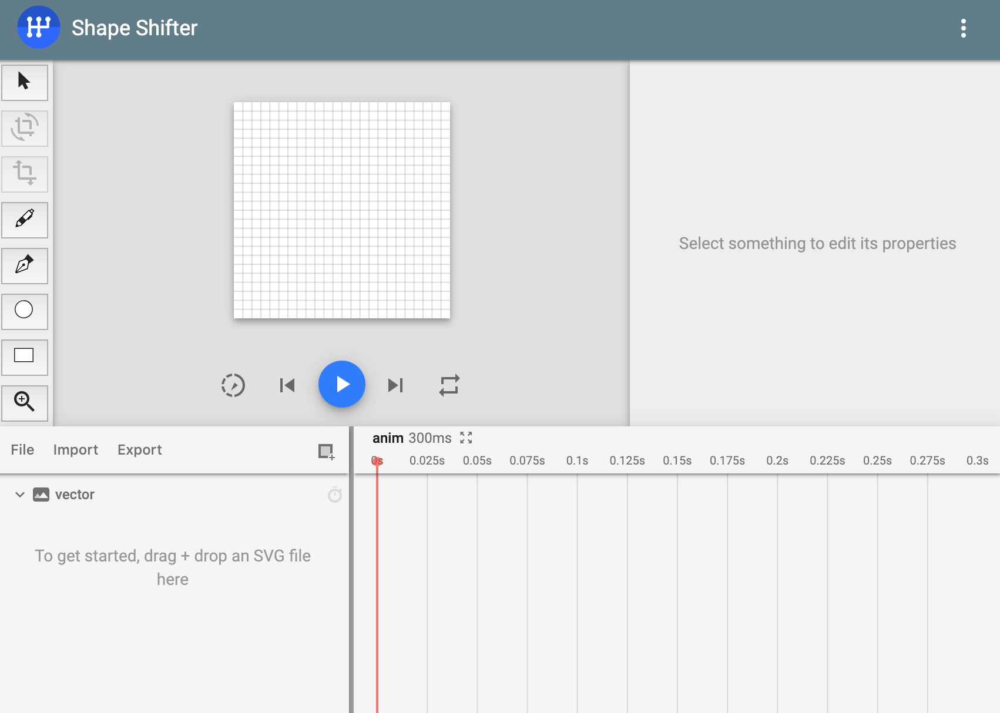
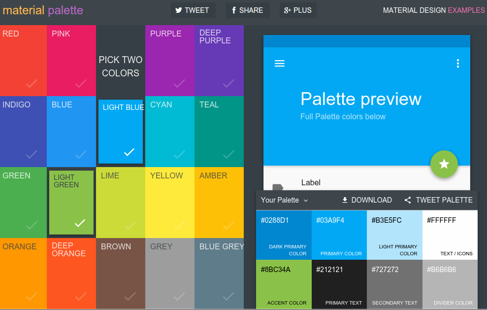
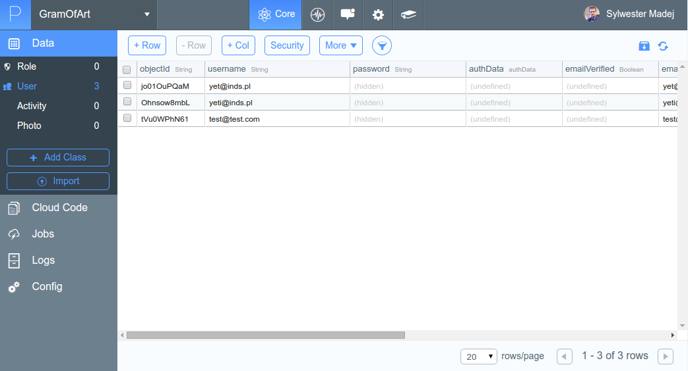
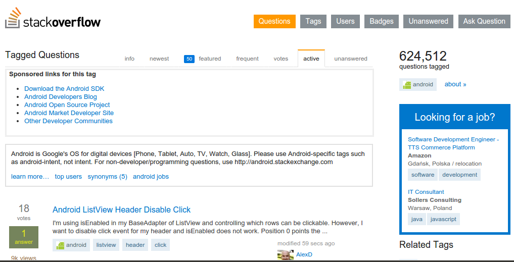
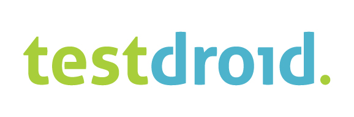
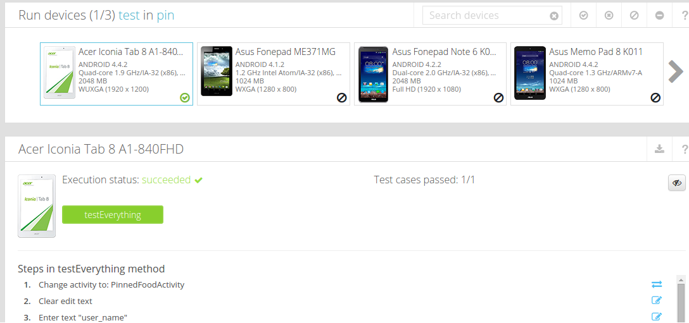
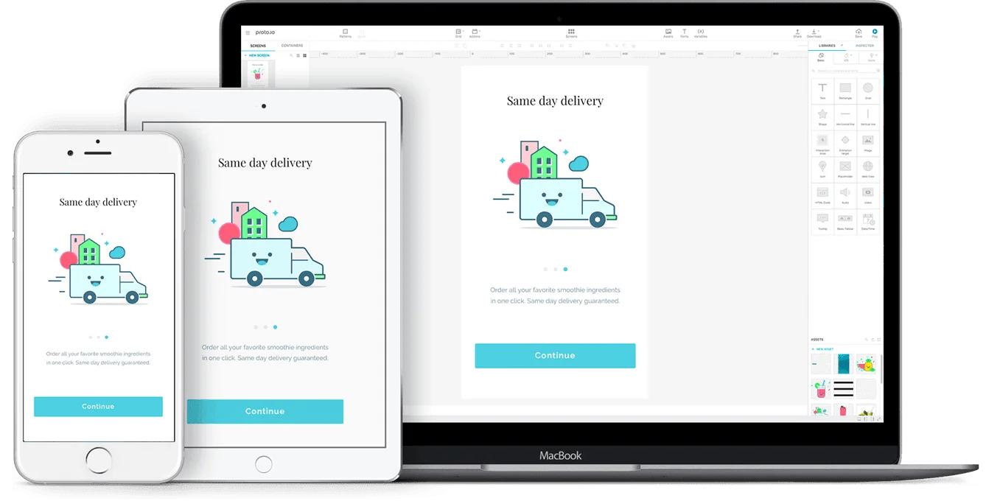
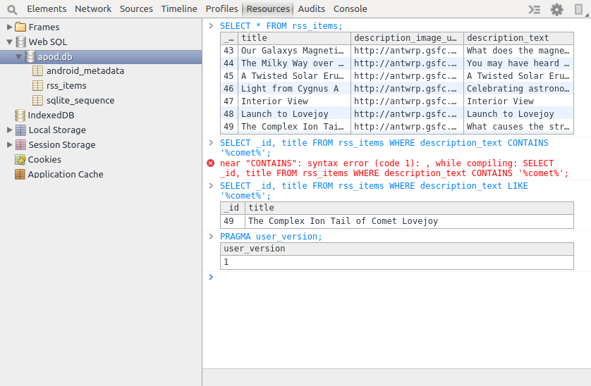
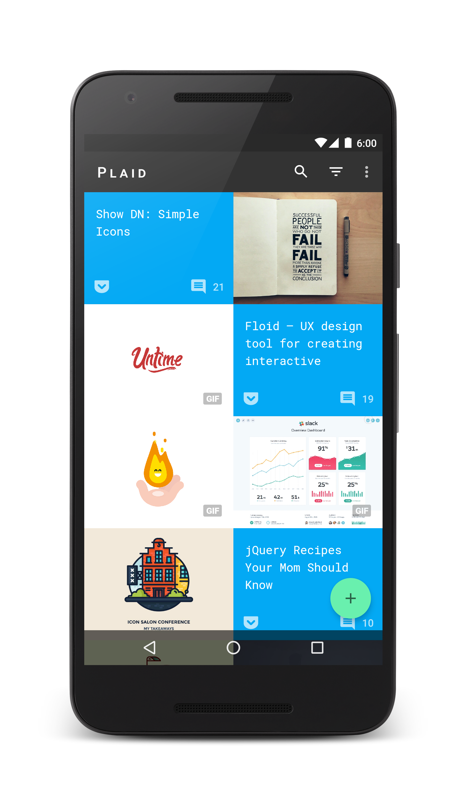

[//]: # (Lepszy tytul)
[//]: # (Lepszy subtytul)
[//]: # (Dodac Drozer?)
[//]: # (Screen invision i ikona)
[//]: # (Screen burp i ikona)
[//]: # (Nowy obrazek AS i ikona)
[//]: # (Lottie Screenshot)
[//]: # (Screenshot jsontokotlin)
[//]: # (https://github.com/mockk/mockk)
[//]: # (https://github.com/aritraroy/UltimateAndroidReference/blob/master/README.md)
[//]: # (https://github.com/mortenjust/androidtool-mac)
[//]: # (https://devknox.io/)
[//]: # (https://github.com/codepath/android_guides)
[//]: # (https://guides.codepath.com/android/Sample-Android-Apps)
[//]: # (Code like a pro: 31 tools for Android app developers)


# Wstęp
Celem niniejszego ebooka jest przedstawienie zestawu narzędzi i zasobów, których używanie wpływa na jakość i wydajność pracy programisty. Każde z nich przetestowałem na własnej skórze, podczas tworzenia wielu aplikacji. Wybór ten potwierdziło wielu programistów, z którymi rozmawiałem na imprezach branżowych, takich jak Mobile Warsaw, Droidcon czy Mobilization.

Postarałem się wybrać po jednym elemencie, z każdej kategorii. W przypadku gdy znam inne, podobne rozwiązania, podaje je jako alternatywy. Ułatwia to proces wyboru osobom początkującym, choć sam wychodzę z założenia, że nie ma narzędzi idealnych do wszystkiego. Dlatego też sam co jakiś czas szukam nowych, lepszych rozwiązań.

Duża część wskazanych przeze mnie narzędzi jest bezpłatna. W przypadku rozwiązań płatnych podaję minimalną cenę, jaką musisz zapłacić jako niezależny programista, za najprostszą, ale funkcjonalną wersję produktu.

Mam nadzieję, że programiści zaczynający swoją przygodę z profesjonalnym tworzeniem aplikacji znajdą tu masę wskazówek, które pomogą im od samego początku pracować "zgodnie ze sztuką". W przypadku osób bardziej doświadczonych, liczę na to, że znajdziecie tutaj co najmniej 2-3 interesujące narzędzia, które przydadzą się w Wam w pracy.

Lubię książki, które podają konkretne kroki i od samego początku przynoszą wartość. Dlatego też mam prośbę: wybierz 1 narzędzie i zacznij z niego korzystać. Gwarantuję, że już po tygodniu zauważysz zmianę na plus!

# Narzędzia
Zacznę od crème de la crème spośród narzędzi do tworzenia aplikacji mobilnych, czyli produktów dostępnych jako aplikacje desktop-owe lub wtyczki do takich aplikacji. Są to elementy, z którymi programista spędza najwięcej czasu. Starałem się, aby wybrane narzędzia dobrze się uzupełniały i stanowiły ekosystem, w którym praca staje się prostsza.

## Kotlin

Zapomnij o Javie. Obecnie w świecie Androida liczy się tylko jeden język. Kotlin powstał jako wewnętrzny projekt twórców Android Studio, firmy JetBrains. Jednak łatwość integracji z AS i współpracy z Javą w projektach Androidowych spowodował, że coraz większa część programistów Androida postanowiła przenieść swoje projekty do Kotlina. 
Google zauważył ten trend i na Google I/O w 2017 ogłosił oficjalne wsparcie dla Kotlina, a w 2019 ogłosił Kotlina jako podstawowy język dla tej platformy.

Kotlin ma wiele zalet, ale przede wszystkim jest zwięzły:

```kotlin
data class Person(var name: String)
```

Odpowiednik w Java

```java
public final class Person {
   @NotNull
   private String name;

   @NotNull
   public final String getName() {
      return this.name;
   }

   public final void setName(@NotNull String var1) {
      Intrinsics.checkParameterIsNotNull(var1, "<set-?>");
      this.name = var1;
   }

   public Person(@NotNull String name) {
      Intrinsics.checkParameterIsNotNull(name, "name");
      super();
      this.name = name;
   }

   @NotNull
   public String toString() {
      return "Person(name=" + this.name + ")";
   }

   public int hashCode() {
      return this.name != null ? this.name.hashCode() : 0;
   }

   public boolean equals(@Nullable Object var1) {
      if (this != var1) {
         if (var1 instanceof Person) {
            Person var2 = (Person)var1;
            if (Intrinsics.areEqual(this.name, var2.name)) {
               return true;
            }
         }
         return false;
      } else {
         return true;
      }
   }
}


```

Jeśli chcesz zacząć przygodę z Kotlinem, to sprawdź mój [darmowy mini-kurs Kotlina](https://szkoleniaandroid.pl/kurs-kotlina)

{pagebreak}

## Android Studio

| *Strona*      | https://developer.android.com/studio |
| *Cena*        | FREE                                        |
| *Alternatywy* | IntelliJ IDEA (€207)            |

{width:30%}


Android Studio (AS) powstało jako rozwinięcie wsparcia dla Androida, dostępnego w edytorze IntelliJ IDEA Community Edition. 
Na Google IO 2013 zostało ogłoszone przez Google jako nowe oficjalne środowisko programistyczne (Integrated Development Environment, IDE) do tworzenia aplikacji na platformę Android. Dzięki połączeniu doskonałego IDE (latami dopracowywanego przez firmę JetBrains) z oficjalnym wsparciem zespołu Google, jest ono zdecydowanie lepsze od ADT (IDE opartego o Eclipse).


W celu maksymalizacji wydajności korzystania z AS, warto poświęcić trochę czasu i nauczyć się skrótów klawiszowych oraz poznać np. mechanizm szablonów generujący kod, który często się powtarza. Każda minuta poświęcona na naukę sztuczek w AS, to inwestycja w przyszłość. Istnieje wiele czynności, które da się przyśpieszyć np.: generowanie par getter/setter, refaktoryzacja kodu, czy chociażby obsługa systemów kontroli wersji z poziomu IDE.

{pagebreak}

## Gradle (New Build System)

| *Strona*      | http://tools.android.com/tech-docs/new-build-system/ |
| *Cena*        | FREE                                                 |
| *Alternatywy* | Maven, Buck                                           |

{width=50%}


Gradle został wybrany przez Google jako podstawa New Build System, który używany jest m.in. w Android Studio. Dzięki mechanizmowi zarządzania zależnościami wykorzystującymi istniejące repozytoria, używane dotychczas przez Maven, możliwe jest korzystanie z setek bibliotek. Wystarczy dodać do pliku build.gradle, po jednej linii tekstu, opisującej każdą z wymaganych zależności. Zastosowanie Gradle pozwoliło ujednolicić konfigurację projektu, dzięki czemu w chwili obecnej budowanie z linii poleceń oraz IDE wygląda tak samo i korzysta z tej samej konfiguracji.

Warto poświęcić kilka godzin, aby poznać bardziej zaawansowane możliwości systemu np. Flavors (smaki projektu), możliwość pisania fragmentów skryptu w języku Groovy lub Kotlin czy choćby opcje dostępne w Android Plugin dla Gradle.

{title="Prosty plik build.gradle dla aplikacji Android"}
~~~~~~~~
apply plugin: 'com.android.application'
android {
    compileSdkVersion 21
    buildToolsVersion "21.1.2"
    defaultConfig { //podstawowa konfiguracja aplikacji
        applicationId "pl.szkoleniaandroid.myapplication"
        minSdkVersion 15
        targetSdkVersion 21
        versionCode 1
        versionName "1.0"
    }
    buildTypes {
        release { //włącz ProGuard przy budowaniu release
            minifyEnabled true
            proguardFiles getDefaultProguardFile('proguard-android.txt'),
		 'proguard-rules.pro'
        }
    }
}
dependencies { //zależności, czyli zewnętrzne biblioteki
    compile fileTree(dir: 'libs', include: ['*.jar'])
    compile 'com.android.support:appcompat-v7:21.0.3'
}
~~~~~~~~

{pagebreak}

## Git

| *Strona*      | http://git-scm.com/    |
| *Cena*        | FREE                   |
| *Alternatywy* | Mercurial, SVN, Baazar |

{width=40%}


Git to rozproszony system kontroli wersji, który powstał aby zarządzać kodem jądra systemu Linux. Jest podstawowym narzędziem, które każdy programista powinien sobie przyswoić, ponieważ pozwala współdzielić kod w zespole, podmieniać wersje, zapisuje również każda modyfikację pliku.

Git w chwili obecnej jest de facto standardem w projektach informatycznych i każdego dnia rośnie ilość narzędzi i usług, które powstały z myślą o nim. W przypadku starszych projektów, nadal można spotkać się jeszcze z narzędziem SVN, które jest rozwiązaniem słabszym, ze względu na konieczność korzystania z centralnego serwera.

Idea pracy z Git opiera się na zapisywaniu kolejnych wersji interesujących nas plików, w lokalnym repozytorium, które znajduje się w katalogu projektu. Dzięki temu możemy śledzić zmiany bez połączenia z siecią i synchronizować się z innymi członkami zespołu, tylko kiedy tego potrzebujemy.


Dużą wartością Git jest bardzo łatwy i lekki sposób pracy z gałęziami (branches), które pozwalają np. pisać nowe elementy aplikacji, jednocześnie mając dostęp do wersji stabilnej.

{pagebreak}

## Jenkins CI

| *Strona*      | http://jenkins-ci.org/      |
| *Cena*        | FREE                        |
| *Alternatywy* | Travis CI, Bamboo, TeamCity |

{width=50%}


Continous Integration (CI), to technika, w której serwer co pewien czas pobiera kod źródłowy i sprawdza czy uda się go skompilować, uruchomić i przetestować. Dzięki temu już w kilka minut po umieszczeniu zmian w systemie kontroli wersji, możemy się dowiedzieć czy coś zepsuliśmy np. poprzez mail rozsyłany do osób zainteresowanych.

Jenkins, to jedna z lepszych implementacji CI, a do tego darmowa. Dużą dodatkową zaletą jest możliwość skorzystania z dziesiątek pluginów, które potrafią obsługiwać różne narzędzia, systemy kontroli wersji lub po prostu wyświetlać czytelne raporty. Pluginem, który na pewno warto używać dla testowania aplikacji jest Android Emulator Plugin, który odpowiada za tworzenie emulatorów, uruchamianie ich i zarządzanie aktualnie uruchomionymi.

Przykładowy cykl, który może realizować Jenkins CI:

1. Pobranie kodu z Git, SVN, Mercurial.

2. Zbudowanie paczki z użyciem Gradle.

3. Instalacja paczki na odpalonym na początku emulatorze, który działa na serwerze) lub urządzeniu.

4. Uruchomienie testów z wykorzystaniem np. Calabash lub Espresso.

5. Po udanym zbudowaniu i przetestowaniu, wysłanie do kanału Alpha w Google Play lub na jakąś usługę do dystrybucji paczek np. Crashlytics.


{pagebreak}

## Sketch

| *Strona*      | https://www.sketch.com       |
| *Cena*        | $99/rok                                      |
| *Alternatywy* | Figma, Photoshop CC |

{width=30%}


Sketch staje się w środowisku designerów następcą Photoshopa. Jego główne zalety to: dostosowanie do pracy z koncepcją ekranów, niska cena, prostota obsługi. Natomiast podstawowa wada, to konieczność korzystania z OS X.

Warto posiadać Sketch jeśli często otrzymujemy projekty graficzne wykonane w tym narzędziu i nie chcemy polegać na kimś, kto może akurat nie mieć czasu. Korzystanie z programu jest proste - można nawet używać go jako narzędzia do tworzenia Mockup'ów aplikacji.


Jest to produkt otwarty na rozwój, z dobrym community, co przekłada się na dużą ilość wtyczek, pozwalających m.in.: na szybki eksport grafik do różnych rozdzielczości. Widziałem nawet wersje, umożliwiające generowanie kodu layoutów prosto z projektu w Sketch.

{pagebreak}

## InVision 

| *Strona*      | https://www.invisionapp.com/ |
| *Cena*        | FREE (1 projekt)                      |
| *Alternatywy* | Zeplin, Avocode              |

Ważnym elementem każdego projektu jest współpraca na linii programista-designer. Jeszcze kilka lat temu oznaczało to, że programista musiał mieć dostęp do Photoshopa, albo musiał polegać na projektancie, który wyeksportuje mu widoki ekranów i zasoby graficzne do popularnego formatu graficznego (PNG, JPG).

Takie podejście powodowało stratę czasu i niedokłaności w odwzorowaniu projektu wynikające np. z trudności zmierzenia odstępów pomiędzy elementami. Na szczęście pojawiła się cała gama rozwiązań, które ułatwiają tę współpracę. Ostatnio najczęściej korzystam z InVision. Jest to aplikacja webowa oraz zestaw pluginów do najpopularniejszych narzędzi graficznych.
W pierwszym kroku designer eksportuje projekt do InVision korzystają z pluginu, a następnie programista może sprawdzać odstępy, kolory i fonty użyte w projekcie oraz samemu eksportować zasoby graficzne do formatów rastrowych lub wektorowych.

{pagebreak}


## Postman – Rest client

| *Strona*      | http://www.getpostman.com/ |
| *Cena*        | FREE                       |
| *Alternatywy* | RESTClient dla Firefox     |

{width=65%}


Bardzo przydatny narzędzie, pozwalające na testowanie API REST, bez konieczności pisania kodu. Przyjemy interfejs użytkownika pozwala na zarządzanie wieloma zapytaniami jednocześnie i testowanie API, z którym będzie się komunikowała nasza aplikacja.

Do głównych zalet Postman'a należy zaliczyć:

* łatwość tworzenia wszelkiego rodzaju zapytań HTTP,

* obsługa metod uwierzytelnienia używanych w HTTP, w tym OAuth,

* formatowanie wyniku zapytania jako JSON albo XML,

* historia zapytań.

Narzędzie to warto wykorzystać, aby sprawdzić API zanim jeszcze zaczniemy implementować dane zapytanie po stronie aplikacji. Ponadto jest to idealne rozwiązanie dla programistów tworzących API, którzy chcą przetestować jak będzie się ono zachowywało dla prawdziwych danych.


{pagebreak}

## DB Browser for SQLite (dawniej SQLite Browser)

| *Strona*      | http://sqlitebrowser.org/           |
| *Cena*        | FREE                                |
| *Alternatywy* | SQLite Manager - plugin dla Firefox |

Kolejne proste narzędzie, które pomoże zaoszczędzić godziny przy tworzeniu aplikacji mobilnych. DB Browser, jak sama nazwa wskazuje, służy do przeglądania zawartości bazy SQLite. Poza przeglądaniem daje także możliwości edycji oraz wykonywania zapytań SQL i podglądu wyników. Jest to doskonała alternatywa dla konsolowego klienta *sqlite3*, który jest dostarczany z SDK Androida. Jedyną wadą jest konieczność pobrania pliku z urządzenia do lokalnego systemu plików np. poleceniem `adb pull`. Gdy to już zrobimy mamy gotowy plik, na którym możemy wykonywać dowolne operacje. Jeśli dokonamy jakichkolwiek zmian, to ten zmieniony plik musimy ponownie umieścić na urządzeniu za pomocą polecenia: `adb push`.


{pagebreak}

## Burp Suite

| *Strona*      | https://portswigger.net/burp |
| *Cena*        | FREE                         |
| *Alternatywy* | CharlesProxy, Fiddler, Mitmproxy |

BurpSuite pozwala na debugowanie komunikacji HTTP pomiędzy aplikacją mobilną, a serwerem. Do działania wykorzystuje mechanizm proxy, czyli urządzenia, przez które przechodzi cały ruch sieciowy. Wystarczy wystartować program i ustawić na urządzeniu nasz komputer, jako serwer proxy, aby móc podejrzeć każdy bajt informacji przesyłany po HTTP, nawet w przypadku szyfrowania SSL.

Właśnie wsparcie dla SSL oraz prostota obsługi sprawiają, że narzędzie to może oszczędzić godziny. Często korzystam też z narzędzia interceptor, które niczym w debugerze, pozwala przerwać request w trakcie i np. zmodyfikować odpowiedź z serwera, jeśli chcę przetestować inny przypadek.

Dodatkowo, polecam czasem przeanalizować co wysyłają na serwer inne aplikacje lub np. usługi Google.


{pagebreak}

## JADX

| *Strona*      | https://github.com/skylot/jadx |
| *Cena*        | FREE                         |
| *Alternatywy* | Dex2Jar |

Dekompilator bajtkodu w formacie dex do Java. Pozwala zobaczyć zawartość wygenerowanego przez nas pliku APK i przeanalizować czy nie zostawiamy w kodzie zbyt dużo informacji, które ktoś może wykorzystać do niecnych celów.

Podstawowe narzędzie do statycznej analizy w przypadku testów bezpiczeczeństwa oraz debugowania kwestii związanych np. z obfuskacją kodu przez ProGuard albo R8.


{pagebreak}


## Vysor

| *Strona*      | https://www.vysor.io/ |
| *Cena*        | FREE / Vysor Pro $2.50/mo, $10/yr, or $40/lifetime |
| *Alternatywy* | Mobizen                    |


Sposób na podejrzenie ekranu telefonu na ekranie komputera. Przydatne zwłaszcza gdy robimy demo dla klienta lub zespołu i potrzebujemy fizycznego urządzenia.

Darmowa wersja wyświetla reklamy, więc przed demo dla klienta warto zainwestować w pełną wersję albo poszukać alternatyw.


{pagebreak}

## Lottie

| *Strona*      | https://airbnb.io/lottie/#/ |
| *Cena*        | FREE                          |
| *Alternatywy* | -                    |

Biblioteka na Androida (i inne platformy) oraz plugin do After Effects. Pozwala na wyświetlanie w aplikacji bardzo efektownych wizualnie animacji, szczególnie przydatny przy tworzeniu splash screen, ekranów logowania i aplikacji lifestylowych, które muszą ładnie wyglądać.

Designer może projektować animacje korzystając z After Effects (de facto standard dla animacji), a następnie wyeksportować animację do pliku JSON i na tym jego rola się kończy.

Programista dodaje do projektu bibliotekę Lottie, wrzuca plik json do zasobów i w kilku liniach kodu jest wstanie zaimplementować dokładnie taki efekt jaki wymyślił designer. Żyjemy w przyszłości! ;)

{pagebreak}


## JsonToKotlinClass

| *Strona*      | https://github.com/wuseal/JsonToKotlinClass |
| *Cena*        | FREE                          |
| *Alternatywy* | -                    |

Świetny plugin do AS i InteliJ Idea, pozwalający przekształcić kod JSON na obiekty modelowe w Kotlinie. Koniec z pracochłonnym, ręcznym budowaniem modelu na podstawie dokumentacji. Wystarczy wynik zapytania np. z Postmana i w kilku kliknięciach otrzymasz gotową strukturę klas.

# Usługi i narzędzia Web

## Shape Shifter

| *Strona*      | https://github.com/alexjlockwood/ShapeShifter |
| *Cena*        | FREE                                             |
| *Alternatywy* | -                                                |

Narzędzie online, które pozwala na pracę z animacjami na obrazach wektorowych. Interfejs użytkownika wygląda jak bardzo uproszczony Adobe Flash, ale pozwala tworzyć m.in. pliki zawierające AnimatedVectorDrawable.

Jest to bardzo dobry sposób na dodanie do aplikacji efektu WOW, bez konieczności tworzenia animacji w kodzie albo w ręcznie w plikach XML. Projekt jest ciągle rozwijany i zmierza w kierunku pełnoprawnego edytora.



{pagebreak}

## Android Pixel Calculator

| *Strona*      | http://angrytools.com/android/pixelcalc/ |
| *Cena*        | FREE                                     |
| *Alternatywy* | -                                        |

Wymiary obiektów na ekranie Androida można podawać w wielu jednostkach. Pixel Calculator pozwala sprawnie poruszać się pomiędzy tymi jednostkami. Dzięki temu można szybko przeliczyć wielkość w dp lub sp, niezależnie od tego dla jakiej gęstości został przygotowany projekt graficzny.


{pagebreak}

## Material Palette

| *Strona*      | http://www.materialpalette.com/ |
| *Cena*        | FREE                            |
| *Alternatywy* | -                               |

Szybki generator palety kolorów, do wykorzystania w aplikacjach zgodnych z Material Design.



{pagebreak}

## Github

| *Strona*      | https://github.com/ |
| *Cena*        | FREE                   |
| *Alternatywy* | Bitbucket, Gitlab         |

{width=50%}


Github to od lat standard jeśli chodzi o przechowywanie kodu w publicznych repozytoriach. Tutaj lądują projekty Open Source, z których korzystasz. Tutaj rekruterzy szukają programistów, którzy nie wstydzą się swojego kodu. Po akwizycji przez Microsoft, Github pozwala też na przechowywanie nieograniczonej ilości prywatnych repozytoriów za darmo. Usługa ta sprawdza się to bardzo dobrze nawet dla dużych zespołów/projektów i pozwala zacząć pracę z Gitem, bez konieczności konfigurowania własnego serwera.

Ponadto serwis stał się swoistą siecią społecznościową dla programistów, a konto na Github stało się nowoczesną alternatywą dla CV. Często na rozmowach rekrutacyjnych konta Github uważane są za bardziej wartościowe niż suche wpisy o projektach w CV, ponieważ pozwalają zobaczyć jakość tworzonego kodu oraz sposób pracy nad projektem.

Dlatego też polecam założenie konta na Github każdemu programiście i tworzenie własnych projektów publicznych lub też udział w istniejących już przedsięwzięciach, poprzez zgłaszanie poprawek w postaci tzw. Pull Request.


{pagebreak}

## Parse

| *Strona*      | https://parse.com                                 |
| *Cena*        | FREE do 30 req/s                                  |
| *Alternatywy* | Firebase, Google AppEngine, Azure Mobile Services |

{width=50%}


Parse było rozwiązaniem typu Mobile Backend as a Service, czyli część serwerowa dla naszej aplikacji, bez konieczności pisania kodu. Twórcy tej usługi postawili sobie za cel uproszczenie do maksimum czynności, które do tej pory trzeba było implementować w API.

Niestety, Facebook najpierw kupił Parse.com, a potem postanowił zawiesić jej działanie (czyli typowy przykład acqui-hire). Na szczęście jednak duża część kodu została udostępniona jako Parse Server, który każdy może zainstalować na własnym serwerze. Jeśli nie chcemy zajmować się instalacją rozwiązania, to możemy skorzystać z jednego z dostawców, którzy oferują hosting pod jednym kliknięciem np. https://back4app.com. Sam często wykorzystuje to rozwiązanie na szkoleniach, dzięki czemu uczestnicy mogą sami stworzyć własną instancję serwera w kilka minut, bez konieczności płacenia w ramach limitów developerskich (np. max 10 req/sec).

Mamy więc mechanizm operowania na danych w tabelach, wysyłanie wiadomości PUSH, analitykę, logowanie FB i Twitter, a nawet pisanie logiki po stronie serwera w JS.

Przykładowo: utworzenie backendu dla aplikacji typu Tinder nie wymaga od nas pisania kodu, ponieważ możemy skorzystać z:

* logowania FB i automatycznego tworzenia kont w Parse,

* zapisywania profilów, wiadomości, położenia użytkownika w odpowiednich tabelach,

* wyszukiwania użytkowników w określonej odległości dzięki geoquery,

* powiadamiania użytkownika o nowych aktywnościach na profilu, poprzez wiadomości PUSH.




{pagebreak}

## Firebase

https://firebase.google.com/

Firebase zaczynało jako alternatywa do Parse, mBaaS pozwalający na przechowywanie danych z możliwością odświeżania aplikacji w czasie rzeczywistym t.j. po każdej modyfikacji danych na serwerze. Google kupując Firebase przekształcił je w kombajn dostarczający wszystko co może przydać się twórcą aplikacji mobilnych. Obecnie Firebase zawiera m.in.:

* bazę danych (odpowiednik Parse),  
* bazę danych pracującą w trybie Real Time,
* obsługę autentykacji użytkowników (logowanie, rejestracja itp.),
* miejsce na plików użytkowników,
* możliwość pisania logiki w JS,
* zbieranie informacji o błędach w aplikacji (patrz Crashlytics),
* obsługę wysyłania wiadomości Push do użytkowników,
* i masę innych.

Model biznesowy przypomina trochę dealera narkotyków: dla bardzo małych aplikacji aplikacja 


## Firebase Crashlytics

| *Strona*      | https://firebase.google.com/docs/crashlytics/          |
| *Cena*        | FREE                               |
| *Alternatywy* | Applause, Splunk MINT |

{width=50%}


Każda aplikacja umieszczona na sklepie wcześniej lub później będzie miała crashe. Nie da się tego uniknąć, bo nie da się też przetestować aplikacji na każdym z dziesiątek tysięcy urządzeń. Dlatego warto wyposażyć naszą aplikację w mechanizm automatycznego zgłaszania błędów, który w przypadku wystąpienia błędu wyśle krótką wiadomość na nasz serwer. Crashlytics sprawdza się w tej roli świetnie, a dodatkowo posiada piękny interfejs web, na którym można przeglądać informację o zaistniałych błędach łącznie z informacjami, na jakim modelu, wersji systemu i sprzęcie wystąpiły.

W przypadku, gdy korzystaliśmy z mechanizmu obfuskacji w ProGuard, będziemy potrzebowali pliku z mapowaniem, ponieważ nazwy metod w których wystąpił błąd będą już zmienione.

{pagebreak}

## Apiary

| *Strona*      | https://apiary.io |
| *Cena*        | FREE                    |
| *Alternatywy* | -                       |

Większosć aplikacji mobilnych na pewnym etapie swojego rozwoju zaczyna korzystać z API (zwykle REST), które często powstaje równolegle z aplikacją. Apiary ma za zadanie ułatwić proces współpracy pomiędzy twórcami API, a twórcami aplikacji.

Apiary stanowi interaktywnej dokumentacji API, która opisuje jakie endpointy są dostępne i jednocześnie pozwala wystawić tzw. mock czyli zaślepkę zwracającą wbite na sztywno dane.

Dzięki temu programiści mobilni mogą zacząć tworzyć i testować aplikację zanim powstanie infrastuktura serwerowa. Oczywiście zakładając, że dokumentacja będzie zdodna z rzeczywistością. 

{pagebreak}


## StackOverflow

| *Strona*      | https://crashlytics.com |
| *Cena*        | FREE                    |
| *Alternatywy* | -                       |

{width=50%}


StackOverflow jest najczęściej na pierwszym miejscu jeśli zadasz w Google pytanie, o konkretny problem. Baza licząca ponad pół miliona pytań dotyczących samego Androida, pozwala często uniknąć godzin siedzenia w poszukiwaniu rozwiązania problemu. Warto jednak wiedzieć, dlaczego to co wklejamy działa, tak aby nie zostawić w swoim kodzie magicznej *czarnej skrzynki*, której każdy boi się dotknąć.

StackOverflow to jednak dużo więcej niż zbiór pytań i odpowiedzi. To społeczność programistów, którzy chętnie dzielą się wiedzą. Wszystko wspomagane systemem punktowym, który pozwala wyróżnić się aktywnym użytkownikom. Dobra reputacja (punkty są nazywane właśnie reputacją) na StackOverflow, to obok konta Github, ważny element wyróżniający CV.



{pagebreak}


## TestDroid

| *Strona*      | http://testdroid.com/ |
| *Cena*        | FREE                  |
| *Alternatywy* | Appthwack, Saucelabs  |

{width=50%}


Testdroid jest jedną z wielu, bardzo podobnych usług do testowania aplikacji mobilnych. W odpowiedzi na zwiększającą się fragmentację urządzeń korzystających z systemu Android, pojawiły się problemy z przetestowaniem aplikacji na dużej liczbie różnych urządzeń. Pojawił się więc pomysł, aby stworzyć miejsca, gdzie można uzyskać dostęp do dużej liczby fizycznych urządzeń, w zamian za niewielką opłatę. 

Tak jak wspomniałem, serwisów takich jest wiele. Różnią się liczbą dostępnych urządzeń, ceną oraz rodzajami testów jakie da się na nich uruchomić. Rzeczą, która wyróżnia Testdroid jest możliwość założenia darmowego konta i dostęp do kilku darmowych urządzeń (dzięki współpracy z firmą Intel, są to głównie urządzenia z procesorami Intel Atom). To pozwala na zapoznanie się z zasadami funkcjonowania serwisu oraz na przeprowadznie testów na kilku dodatkowych urządzeniach.

Dodatkową cechą wyróżniającą, jest możliwość użycia narzędzia Testdroid Recorder, które pozwala nagrywać testy manualne i powtarzać je, na wielu urządzeniach jednocześnie.



{pagebreak}

## Proto.io

| *Strona*      | https://www.fluidui.com/   |
| *Cena*        | FREE                       |
| *Alternatywy* | Proto.io, Balsamiq Mockups |

{width=50%}


Klikalne prototypy stanowią jedną z najlepszych form dokumentacji w komunikacji programista<->klient. Pozwalają przedstawić potrzebne ekrany, sposoby nawigacji pomiędzy nimi oraz przetestować aplikację na żywym organizmie, bez konieczności uruchamiania IDE. Bardzo często zmniejszają ryzyko niedomówień lub ujawniają braki w projekcie.

Warto zacząć tworzenie prototypu już na etapie tworzenia lub czytania specyfikacji. Najlepiej jeśli jest to mockup typu Lo-Fi (niskiej szczegółowości, bez graficznych ozdób), tak aby klient nie przywiązywał się do jego wyglądu, tylko skupiał na nawigacji i kompletności danych.

Proto.io jest przykładem rozwiązania, które pozwala zaprojektować ekrany, dodać proste akcje (np. przejścia pomiędzy ekranami po naciśnięciu przycisku) i zaprezentować wynik w przeglądarce na telefonie klienta. Wystarczy przesłać link do wygenerowanego prototypu, który potencjalny użytkownik, może sobie przetestować na urządzeniu.



{pagebreak}

# Biblioteki
Każdy programista dochodzi do takiego momentu, gdy stwierdza, że coraz więcej kodu, który pisze się powtarza. Dlatego właśnie tak ważne jest w projektach korzystanie z bibliotek, zwłaszcza z tych, które są sprawdzone i uznawane za standard. Dzięki temu, ktoś kto będzie przeglądał nasz projekt od razu będzie czuł się jak w domu.

## Android Jetpack

| *Strona*      | https://developer.android.com/jetpack   |
| *Cena*        | FREE                                 |
| *Alternatywy* | - |

{width=50%}


Jetpack to duży ukłon firmy Google w kierunku programistów. Jest to zestaw bibliotek i narzędzi, które stworzone zostały, aby dobrze się uzupełniać i tworzyć spójną architekturę. Warto przejrzeć je wszystkie, przynajmniej pobieżnie, a szczególną uwagę zwrócić na [Architecture Components](https://developer.android.com/topic/libraries/architecture/).

### Data Binding

Biblioteka pozwalająca na łączenie widoków z danymi na poziomie plików XML z Layoutami. W najprostrzym przypadku pozwala pozbyć się findViewById(), jednak zwykle używana jest do odseparowania logiki od prezentacji z użyciem wzorca MVVM (Model-View-ViewModel).

### ViewModel
Bardzo prosta biblioteka zdejmująca z programisty błędogenny proces przechowywania stanu obiektów pomiędzy zmianami konfiguracji poprzez automatyczne zarządzanie cyklem życia obiektów typu ViewModel z MVVM.

### Room
Bardzo dobrze napisana biblioteka ORM (do mapowania obiektowo-relacyjnego), która upraszcza pracę z bazą SQLite w naszej aplikacji. Większość kodu generowana jest na etapie kompilacji na podstawie metadanych, które podamy m.in. zapytań SQL. Ważną zaleta jest dobra integracja z Android Studio, która pozwala m.in. na podpowiadanie kodu przy pisaniu zapytań SQL. 

### LiveData
Implementacja wzorca Obserwatora, która doskonale pozwala łączyć powyższe elementy, dzięki czemu np. widok (DataBinding) może reagować na zmiany w bazie danych (Room) poprzez obiekt LiveData przechowywany w ViewModelu.
Obiekty typu LiveData pozwalają na przekształcanie obiektów pomiędzy warstwami naszej aplikacji lub łączeniem kilku obiektów w jeden. 

{pagebreak}


## Biblioteki Square


### Retrofit

| *Strona*      | https://square.github.io/retrofit/   |
| *Cena*        | FREE                                 |
| *Alternatywy* | Ktor, Volley |

Retrofit to najprzyjemniejszy sposób korzystania z API REST z poziomu Androida. Naszym zadaniem jest napisanie interfejsu zawierającego wszystkie metody, które będziemy chcieli wywołać na API, oraz dorzucenie anotacji, które opisują pod jakie URL-e mają te zapytania uderzać, jakie parametry wysyłać i co odbierać.

Resztę generuje za nas Retrofit. Otrzymujemy konkretną klasę, na której możemy wywoływać te metody. Wbudowana obsługa GSON, zapewnia nam automatyczne mapowanie obiektów POJO na JSON i odwrotnie. Łatwiej się nie da.


Przykładowy interfejs opisujący API:

```java
public interface GitHubService {
  @GET("users/{user}/repos")
  Call<List<Repo>> listRepos(@Path("user") String user);
}
```

Na jego podstawie Retrofit może szybko wygenerować implementację klienta HTTP:

```java
Retrofit retrofit = new Retrofit.Builder()
    .baseUrl("https://api.github.com/")
    .build();

GitHubService service = retrofit.create(GitHubService.class);
```

Teraz wystarczy tylko zawołać wygenerowaną metode i pronto!

```java
Call<List<Repo>> repos = service.listRepos("octocat");
```


### Picasso

| *Strona*      | http://square.github.io/picasso/       |
| *Cena*        | FREE                                   |
| *Alternatywy* | Glide, Universal Image Loader |

Picasso to biblioteka służąca do wyświetlania obrazków z internetu. Kropka. Posiada proste API i automatyzuje pobieranie plików graficznych, zmianę ich rozmiaru, wyświetlanie w ImageView, cache w pamięci ram i flash. Dzięki temu możemy skupić się na tym, co ma być wyświetlone, a nie jak.


### Timber

### Leak Canary


{pagebreak}

## Dagger 2

| *Strona*      | https://github.com/google/dagger |
| *Cena*        | FREE                            |
| *Alternatywy* | Koin              |

Dagger to implementacja wzorca Dependency Injection, czyli wstrzykiwania zależności. Celem tego podejścia jest minimalizacja ilości miejsc, w których tworzymy obiekty poprzez `new NazwaKlasy()` i stworzenie centralnego repozytorium obiektów, które możemy wstrzyknąć w dowolnym miejscu aplikacji. W przypadku Androida jest to szczególnie przydatne, ponieważ często potrzebujemy w różnych Activity albo Fragmentach dostępu do np. SharedPreferences. Polecam przeczytanie dokumentacji i rozpoczęcie od wstrzykiwania prostych obiektów np. swoich Managerów.

{pagebreak}

## RxJava

| *Strona*      | https://github.com/ReactiveX/RxJava |
| *Cena*        | FREE                                   |
| *Alternatywy* | -                                      |

Biblioteka RxJava, pozwala wprowadzić do Javy nowy paradygmat - programowanie reaktywne (Reactive Programming). Jest to podejście upraszczające w znaczny sposób kod, którego zadaniem jest zarządzanie wieloma zadaniami asynchronicznymi, zwłaszcza takimi, które operują na danych. Dobrym przykładem jest fragment aplikacji wymagający np. jednoczesnego wywołania wielu zapytań HTTP i połączenia ich wyników. 

RxJava nie jest biblioteką, którą mogę polecić początkującym programistom. Jeśli jednak Twoje aplikacje stają się coraz większe i rośnie liczba zdarzeń lub zapytań HTTP, które wysyłasz to polecam przestudiowanie dokumentacji https://github.com/ReactiveX/RxJava/wiki.

{pagebreak}

## Stetho

| *Strona*      | https://facebook.github.io/stetho/ |
| *Cena*        | FREE                       |
| *Alternatywy* | -     |

Stetho to biblioteka, która pozwala debugować aplikację z użyciem Chrome Developer Tools. Pozwala, w czasie rzeczywistym, podglądać hierarchię widoków, zawartość bazy danych i SharedPreferences, a nawet monitorować zapytania HTTP.

Integracja jest bardzo łatwa i sprowadza się do dodania zależności w Gradle oraz zainicjalizowania biblioteki przy starcie aplikacji.

```java
public class MyApplication extends Application {
  public void onCreate() {
    super.onCreate();
    Stetho.initializeWithDefaults(this);
  }
}
```

Opcjonalnie można dodać jeszcze interceptor do OkHttp, aby móc podsłuchiwać ruch HTTP.

```java
new OkHttpClient.Builder()
    .addNetworkInterceptor(new StethoInterceptor())
    .build();
```




## BindingCollectionAdapter

| *Strona*      | https://github.com/evant/binding-collection-adapter |
| *Cena*        | FREE                       |
| *Alternatywy* | -    |

Prosta biblioteka, która sprawi, że zapomnisz jakim bólem było pisanie adapterów do ListView i RecyclerView. Doskonale uzupełnia Data Binding i pozwala na automatyzację łączenia elementów kolekcji w ViewModelu z layoutami, eliminując tym samym masę boilerplate code.

Łatwo można dodać obsługę wielu typów elementów na liście albo np. dodać obsługę kliknięcia na elemencie.

Przykładowe użycie w ViewModelu:

```java
public class ViewModel {
  //place your models here
  public final ObservableList<String> items = new ObservableArrayList<>();
  //describe how they should bind to layouts
  public final ItemBinding<String> itemBinding = ItemBinding.of(BR.item, R.layout.item);
}
```

{pagebreak}


# Kody źródłowe

## Google IO App

https://github.com/google/iosched

Każdego roku Google IO jest najważniejszą konferencją, na której ekipa z Mountain View prezentuje nowości w SDK Androida. Niedługo po tym wydarzeniu udostępniany jest kod źródłowy oficjalnej aplikacji, powstałej na to wydarzenie, która jednocześnie prezentuje jak najwięcej z nowości w SDK.

Warto przejrzeć, choć z doświadczenia wiem, że kod nie jest idealny i trudny w czytaniu, ale zdecydowanie prezentuje dużo nowości.


## Plaid 

https://github.com/android/plaid

{width: 50%, align: left}

{width: 50%, align: right}


Przeglądarka wiadomości ze stron Designer News, Dribbble i Product Hunt stworzona przez ludzi z zespołu Androida. Bardzo dobrze ilustruje sposób implementacji Material Design oraz architektury w oparciu o Architecture Components.

# Źródła wiedzy

## Strony

### Vogella Android Tutorials
http://www.vogella.com/tutorials/android.html

Znane źródło bardzo dopracowanych tutoriali opisujących popularne zagadnienia z zakresu programowania na Androida i nie tylko.


### SzkoleniaAndroid.pl - Blog
https://SzkoleniaAndroid.pl/blog/

Blog, który tworzę w wolnym czasie pomiędzy projektami i szkoleniami. Staram się przekazywać spostrzeżenia dotyczące tworzenia aplikacji, zwłaszcza od strony warsztatu programisty.

### Android Weekly
http://androidweekly.net/

Cotygodniowa porcja przydatnych zasobów dotyczących programowania na Androida, przebranych i zebranych w jednym miejscu. Nowe biblioteki, posty na blogach i filmy wideo. Istnieje możliwość przeglądania na stronie internetowej, lub zamówienie subskrybcji wprost do skrzynki email.

### MaterialUp
http://www.materialup.com/

Ładny katalog ładnych aplikacji. Celem MaterialUp jest prezentowanie dobrych przykładów impementacji stylu Material Design w aplikacjach. Są tu nie tylko aplikacje Android, ale także iOS, a nawet aplikacje Web. Dobre źródło inspiracji i benchmarków. Zawsze polecam swoim klientom, aby zobaczyli co mogą zyskać idąc w kierunku Material Design.

### Android Arsenal
https://android-arsenal.com/

Największy katalog bibliotek, narzędzi i przykładów na Androida. Z możliwością przeszukiwania wg. różnych kryteriów m.in. cena, rodzaj, zastosowanie. Można potraktować jako rozbudowaną wersję tego ebooka. Niestety liczba dostępnych elementów powoduje, że pomiędzy perełkami jest dużo słabych bibliotek.

Alternatywy: https://www.android-libs.com


{pagebreak}

## Kanały YouTube
Dla tych, którzy wolą oglądać wideo, zamiast czytać istnieje kilka kanałów, które warto dodać do swoich subskrybcji na YouTube, aby na bieżąco dostawać powiadomienia.

### SzkoleniaAndroid.pl - YouTube
https://www.youtube.com/channel/UCQUuM6One5W6odx8dDJ8Vsw

I znów kryptoreklama. Początkowo umieszczałem kursy, chwilowo lądują tam głównie zapisy z moich prezentacji na różnych wydarzeniach. Szczerze zachęcam do subskrybcji.

### Android Developers
https://www.youtube.com/channel/UCVHFbqXqoYvEWM1Ddxl0QDg

Ważny kanał dla tych, którzy chcą wiedzieć co nowego Google tym razem dodał do Androida. Oficjalny kanał, na którym zespół programistów z Google informuje o zmianach, a także pokazuje najlepsze praktyki. Aktywny najbardziej po Google IO, gdy następują ogłoszenia nowych API i narzędzi.

### Google Developers
https://www.youtube.com/channel/UC_x5XG1OV2P6uZZ5FSM9Ttw

Drugi oficjalny kanał. Związany nie tylko z samym Androidem, ale także otaczającym go ekosystemem usług Google.

### NewCircle Training
https://www.youtube.com/channel/UCkQX1tChV7Z7l1LFF4L9j_g

Świetne źródło doskonałych prezentacji z zakresu różnych zagadnień. Warto obejrzeć zwłaszcza serię Android Bootcamp. Jest już nieco czasowa, ale większość poruszonych tam tematów nadal jest aktualna i bardzo dobrze wytłumaczona.


{pagebreak}

## Książki

### The Busy Coder's Guide to Android Development
http://commonsware.com/Android/

Nietypowa książka autorstwa Mark'a Murphy'ego. Dostępna jedynie w postaci 12-miesięcznej subskrypcji, w trakcie której otrzymujemy dostęp do aktualizacji książki - zwykle jest kilka rocznie. Jedyny tytuł, który mogę polecić z czystym sumieniem, ponieważ w każdym momencie jest aktualna. No i ta objętość: prawie 3000 stron (tak, trzy tysiące)!

# Warto śledzić

## Jake Wharton

| *Strona*  | http://jakewharton.com/               |
| *Twitter* | https://twitter.com/JakeWharton       |
| *G+*      | https://plus.google.com/+JakeWharton/ |

{width=10%, float=right}


Człowiek instytucja. Twórca wielu z przytoczonych bibliotek. Autorytet w kwestii upraszczania kodu, korzystania z anotacji oraz SDK.

## Romain Guy

| *Strona*  | http://www.curious-creature.com/    |
| *Twitter* | https://twitter.com/romainguy       | 
| *G+*      | https://plus.google.com/+RomainGuy/ |

{width=10%, float=right}


Googler pracujący nad Androidem. Często prezentuje nowości związane z UI.
&nbsp;  &nbsp;
  &nbsp;&nbsp;
  &nbsp;&nbsp;
  &nbsp;&nbsp;

## Chris Banes

| *Strona*  | https://chris.banes.me/              |
| *Twitter* | https://twitter.com/chrisbanes       |
| *G+*      | https://plus.google.com/+ChrisBanes/ |

{width=10%, float=right}


Googler odpowiedzialny za relacje z developerami. Twórca wielu elementów biblioteki zgodności m.in. AppCompat.

Często dzieli się na swoich profilach fragmentami kodów, realizujących konkretne zadania np. znikający Toolbar.

{pagebreak}

## Nick Butcher

| *Strona*  | http://www.curious-creature.com/      |
| *Twitter* | https://twitter.com/crafty            |
| *G+*      | https://plus.google.com/+NickButcher/ |

{width=10%, float=right}


Googler odpowiedzialny za relacje na styku design/development. Umieszcza bardzo fajne prezentacje i przykłady. Dużo udziela się na kanale YouTube Android Developers.


## Wojtek Kaliciński

| *Strona*  | https://medium.com/@wkalicinski     |
| *Twitter* | https://twitter.com/crafty            |
| *GitHub*      | https://plus.google.com/+NickButcher/ |

{width=10%, float=right}


TODO

## Mark Murphy

| *Strona*  | https://commonsware.com/mmurphy |
| *Twitter* | https://twitter.com/commonsguy  |
| *G+*      | -                               |

{width=10%, float=right}


Twórca CommonsWare i autor ksiązki "The Busy Coder’s Guide to Android Development". Znajduje się w Top 10 najbardziej aktywnych osób na StackOverflow. Jeśli szukasz odpowiedzi na pytanie o Androida, duża szansa, że to on odpowie. Twórca dużej ilości bibliotek i częsty speaker na popularnych konferencjach mobilnych.

# Reklama :)

## Zasubskrybuj kanał Szkolenia Android na YouTube
https://www.youtube.com/channel/UCQUuM6One5W6odx8dDJ8Vsw?sub_confirmation=1

## Śledź Sylwester Madej na Twitter
https://twitter.com/smdremedy

## A przede wszystkim czytaj bloga
https://SzkoleniaAndroid.pl/blog/
